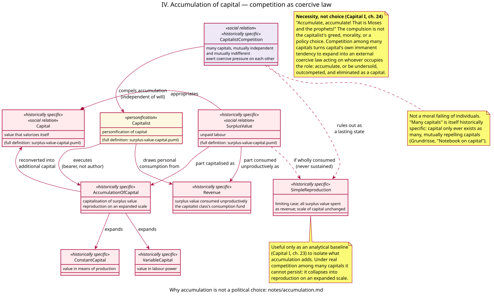

# Accumulation of capital — model notes

Companion to [`models/accumulation.puml`](../models/accumulation.puml). Full stereotype legend: [stereotypes.md](stereotypes.md); every relationship in this diagram is indexed in [relationships.md](relationships.md). Presupposes [surplus-value.md](surplus-value.md): `Capital`, `SurplusValue`, and `Capitalist` are used here as already defined there.

This increment has one purpose: to show that the accumulation of capital is not the capitalist's personal preference, and not a matter that a government could decide differently by policy. It is a compulsion that many capitals in competition exert on whoever occupies the role of capitalist — a structural feature of the relation itself, not a subjective or political variable.

---

## 1. What this increment models, and what it deliberately doesn't

It models only the mechanism of compulsion:

- `SurplusValue` divides into a part consumed unproductively (`Revenue`) and a part reconverted into additional capital (`AccumulationOfCapital`).
- `CapitalistCompetition` — many capitals, mutually independent, each trying to sell — compels the `Capitalist` toward the second branch, independently of personal will.
- `SimpleReproduction` (all surplus value consumed as revenue) is modelled only as an analytical limiting case that competition rules out as a lasting state.

It does **not** model reproduction schemas (*Capital* II, Departments I and II). Equalisation of profit rates is in [prices-of-production.md](prices-of-production.md). Concentration, centralisation, and the reserve army — the rest of *Capital* I, ch. 25 — are modelled in [concentration.md](concentration.md). This increment isolates the compulsion to reinvest.

---

## 2. The argument: necessity, not choice

`Capital` is already, by definition, "value that valorizes itself" (surplus-value.md §7). But self-expansion in that abstract sense is compatible with a capitalist who simply spends the whole surplus on personal consumption — nothing in the bare concept of value forces reinvestment. Marx's own limiting case for this is `SimpleReproduction` (*Capital* I, ch. 23): reproduction on the same scale, surplus value fully consumed as revenue, capital's magnitude unchanged.

Simple reproduction is a valid analytical device — Marx uses it to isolate what accumulation *adds* — but it is not a description of any capitalist's real, sustained situation. The reason is `CapitalistCompetition`: capital never exists as one capital, only as **many**, mutually independent and mutually indifferent capitals confronting each other in the market (Grundrisse, notebook on capital). Each is under pressure to cheapen its output and expand its scale. A capitalist who accumulates nothing, while rivals plough surplus value back into more machinery, more raw materials, more labour-power, is soon selling at a higher cost than competitors, losing market share, and going under.

Marx states the conclusion starkly, in a passage that is one of the best-known lines in *Capital*:

> "Accumulate, accumulate! That is Moses and the prophets!"
> — *Capital* I, ch. 24 (Aveling/Moore) / ch. 25 (Fowkes), §3

The sentence is deliberately biblical and ironic: it is not a moral commandment the capitalist chooses to obey out of conviction. It is what competition makes of capital's own tendency to expand — an "immanent law" of the value-relation turned, by the existence of *many* capitals, into a coercive law bearing down on each of them from the outside. Refuse it, and the penalty is not social disapproval; it is elimination as a capital.

This is the precise sense in which accumulation is **immutable** here: not that it is a law of nature outside history (it is thoroughly historically specific — see below), but that *given* commodity production organised as many independent, competing capitals employing wage-labour, no individual capitalist and no government policy addressed to individual capitalists' choices or "greed" can suspend the compulsion without dissolving that structure — i.e., without abolishing capital and wage-labour as a social relation. That is a different thing from a subjective attitude, and a different thing from a policy that could, in principle, be reversed by a different government while capital and wage-labour remain in place.

---

## 3. Classes

### `CapitalistCompetition`

Many capitals, mutually independent and mutually indifferent, each producing for an anonymous market. `<<social relation>>` and `<<historically specific>>`: it is not a physical interaction between things, and it does not exist wherever people produce — only where production is organised as many separate units of capital producing commodities for sale against one another. This is the class that does the compelling; it has no counterpart in the surplus-value increment, where a single, generic `Capitalist`/`Capital` pair was enough to show *how* surplus value is produced. Showing *why* it must be reinvested requires more than one capital.

### `Capitalist` (recap)

Personification, as in surplus-value.md §7: not a psychological type, a moral character, or a theory of human nature. Here that stereotype does real work: the compulsion attaches to the *role*, not to whichever individual currently occupies it. Replace the person — by inheritance, by a share sale, even by a change of political conviction on the incumbent's part — and the compulsion to accumulate falls just as heavily on the successor, because it is a property of the relation (capital confronting other capitals), not of the personality.

### `AccumulationOfCapital`

The part of surplus value that is reconverted into additional constant and variable capital: "capitalisation of surplus-value," reproduction on an expanded scale. This is accumulation proper — the historically specific process this increment exists to explain.

### `Revenue`

The part of surplus value the capitalist class consumes unproductively — its own individual consumption fund. Modelled as a real, necessary branch (capitalists do consume), but a subordinate one: it is the residual left over once the compulsion to accumulate has been satisfied, not the driver of the system. Marx's own polemical point in ch. 24 is aimed at classical economists who moralised this split as "abstinence" versus "extravagance," as though it were a matter of individual virtue rather than a division forced by competitive conditions specific to a given branch of industry and its rivals.

### `SimpleReproduction`

The counterfactual in which *all* surplus value is consumed as revenue and none is accumulated. Marked `{abstract}` in the diagram: like `LabourProcess` or `Value` in the surplus-value increment, it is a determination that does not exist on its own once `CapitalistCompetition` is in play — it is a limiting case used to isolate accumulation's effect, immediately negated by the real relation of many capitals.

### `ConstantCapital`, `VariableCapital` (recap)

As in surplus-value.md §7: value in means of production and value in labour-power respectively. Here they are simply the two things additional capital is laid out on — accumulation is productive reinvestment (more means of production, more labour-power employed), not hoarding money. What credit and finance do to *mediate* that reinvestment is modelled in [finance.md](finance.md).

---

## 4. Materialism, not moralism

The model is deliberately built so that no class represents a capitalist's character, ethics, or intentions as an explanation of anything. `Capitalist` has exactly the same stereotype (`personification`) and the same relation to `Capital` as in the surplus-value increment; nothing new is added to "explain" accumulation psychologically.

- A capitalist who is personally frugal, or personally generous, or genuinely believes in restraining growth, does not thereby escape `CapitalistCompetition --> Capitalist : compels accumulation`. Good intentions do not appear anywhere in the diagram, because they do not appear anywhere in the mechanism.
- Conversely, a capitalist who accumulates aggressively is not being explained by greed. Marx is explicit that this side of the capitalist — the fanatical drive to expand value for its own sake — is not what interests the analysis; "what interests us here is [the] law of motion" the relation imposes, regardless of the personal psychology of whoever is, for the time being, its bearer.

This is the same materialist discipline as surplus-value.md §3: no hidden essence, no metaphysics of "capitalist nature." The compulsion is external and structural — a product of many capitals in competition — not internal and characterological.

---

## 5. Why this rules out "political choice"

Because the compulsion is generated by the relation between many capitals, not by any single capitalist's or any single government's decision, it cannot be legislated away while that relation remains in place:

- A government can tax profit, subsidise investment, regulate hours, or otherwise change the *terms* on which accumulation happens. It cannot exempt capitals operating within (or trading into) a competitive market from the compulsion itself without removing them from that market altogether.
- Nationalising an industry does not, by itself, remove the compulsion either. A nationalised industry that still buys and sells, still competes for markets, investment, or resources — domestically or internationally — still faces the same coercive law in a different legal costume. This is the basis of the SPGB's long-standing argument that state capitalism is still capitalism: changing *who* personifies capital (a state bureaucracy instead of a private owner) does not touch the relation that produces the compulsion to accumulate. That argument is typed in [state.md](state.md) (`StateCapital`, `NationalisationAbolishesCapital`).
- What would remove the compulsion is removing the conditions that generate it: production no longer organised as many independent units of capital competing for sale, and labour-power no longer bought and sold as a commodity. That is a change in the mode of production, not a change of policy within it — which is exactly the SPGB's case for why capitalism cannot be reformed into a system that accumulates only when, and only as much as, is socially deliberated.

---

## 6. What is deferred

- Reproduction schemas — Departments I and II, the value and physical balancing conditions for simple and expanded reproduction (*Capital* II, ch. 20–21).
- The tendency of the rate of profit to fall (*Capital* III, Part 3).
- The credit cycle and crises — how claims on future surplus value can outrun production. Interest-bearing capital is in [finance.md](finance.md); titles in [fictitious-capital.md](fictitious-capital.md); the general law of accumulation in [concentration.md](concentration.md).

---

## 7. Sources

**Marx**

- *Capital* I, ch. 23 — simple reproduction as an analytical baseline.
- *Capital* I, ch. 24 (Aveling/Moore) / ch. 25 (Fowkes), §§1–3 — conversion of surplus value into capital; "Accumulate, accumulate! That is Moses and the prophets!"; the critique of the "abstinence theory."
- *Capital* I, ch. 25 (Aveling) / ch. 25 §§4–5 (Fowkes) — the general law of capitalist accumulation — now [concentration.md](concentration.md).
- *Grundrisse*, notebook on capital ("many capitals") — capital exists only as many, mutually repelling and attracting capitals; competition as the form in which capital's own immanent laws are imposed on it from outside.
- *Capital* III, Part 2 — competition and the formation of a general rate of profit — referenced here as deferred, not modelled.

**Socialist Party of Great Britain**

- The case against reformism and for the "state capitalism" analysis of nationalisation and the USSR — used here for §5: changing the legal personification of capital does not remove the compulsion to accumulate. See the SPGB's *An A–Z of Marxism* entries on "State Capitalism" and "Reformism," and *Socialist Standard* articles making the same argument against both nationalisation and Keynesian demand management as ways of "controlling" capitalism's drive to accumulate.
