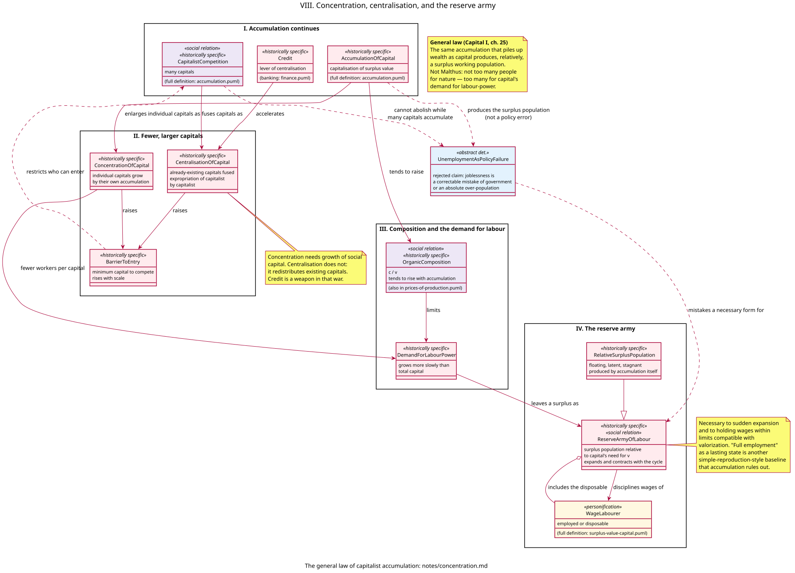

# Concentration, centralisation, and the reserve army — model notes

Companion to [`models/concentration.puml`](../models/concentration.puml). Full stereotype legend: [stereotypes.md](stereotypes.md); every relationship in this diagram is indexed in [relationships.md](relationships.md). Presupposes [accumulation.md](accumulation.md) (the compulsion to capitalise surplus value) and [surplus-value.md](surplus-value.md) (`c`, `v`, labour-power as commodity). [prices-of-production.md](prices-of-production.md) is presupposed only for `OrganicComposition` and for the point that `CapitalFlow` equalises rates *among capitals that can enter*.

This increment has one purpose: to show the rest of Marx’s “general law of capitalist accumulation” (*Capital* I, ch. 25). The same process that enlarges capital produces fewer, larger units of capital and a working population that is surplus *relative to capital’s demand for labour-power*. Unemployment is not a correctable mistake of government and not Malthus’s “too many people for nature.”

---

## 1. What this increment models, and what it deliberately doesn't

It models:

- `ConcentrationOfCapital` — individual capitals grow by their own accumulation;
- `CentralisationOfCapital` — already-existing capitals are fused (expropriation of capitalist by capitalist), accelerated by competition and by `Credit`;
- `BarrierToEntry` — the minimum capital needed to compete rises with scale, so the “many capitals” of the accumulation increment become fewer who can enter;
- the tendency of `OrganicComposition` (`c/v`) to rise, so `DemandForLabourPower` grows more slowly than total capital;
- `ReserveArmyOfLabour` / `RelativeSurplusPopulation` as a form necessary to accumulation (expansion, contraction, discipline of wages);
- `UnemploymentAsPolicyFailure` as a contrast class: the rejected claim that joblessness is a policy error or an absolute over-population.

It does **not** model the falling rate of profit as a law of the average rate (*Capital* III, Part 3), crises as a concrete totality, reproduction schemas, or the state as an employment-manager. Those presuppose this increment.

---

## 2. Concentration is not the same as centralisation

Marx draws a cut the everyday word “concentration” blurs.

**Concentration** is the growth of a capital out of its own surplus value. Each functioning capital becomes a larger command over means of production and labour-power because accumulation has reconverted `s` into additional `c` and `v`. This requires growth of social capital: more surplus value has actually been produced and capitalised.

**Centralisation** is the fusion of capitals that already exist. One capital swallows another (or they amalgamate) without a new increment of social surplus value having to be produced first. Competition is the war; the larger cost-price and cheaper output win. Credit is a weapon in that war: it gathers idle money-capital ([finance.md](finance.md)) and places it at the disposal of the capitals that are doing the swallowing. Marx: expropriation of *capitalist* by *capitalist*.

Concentration needs the growth of the total. Centralisation redistributes the total. That is why a crash, a merger wave, or a credit-fuelled buyout can centralise capital in a few years while social accumulation crawls.

Both raise `BarrierToEntry`. The field assumed by `CapitalistCompetition` and by `CapitalFlow` (prices of production) is not a door that stays open. The average rate is a tendency among those who can still advance the minimum capital. That is a determination of the same competition, not an exception to it.

---

## 3. Why the demand for labour-power lags

Accumulation does not mean “more machines *and* proportionally more workers.” Technical change under the compulsion to cheapen (relative surplus value; competition) raises the mass of means of production set in motion by a given labour-power. `OrganicComposition` tends to rise. `DemandForLabourPower` is demand for *variable* capital. It can grow in absolute terms while shrinking *relative* to total capital. A larger social capital then employs a smaller fraction of the working population as `v`.

That lag is how accumulation *produces* a surplus population. The extra people are not surplus to nature or to the possibility of useful work. They are surplus to capital’s need to valorize. Marx is explicit against Malthus: the law is historically specific to this social form.

---

## 4. The reserve army is necessary, not accidental

`ReserveArmyOfLabour` is the working population that capital does not currently employ as `v`, but that remains available: the unemployed, the irregularly employed, the latent surplus (e.g. agriculture shedding labour), the stagnant (the hardest to re-absorb). `RelativeSurplusPopulation` is Marx’s name for that produced surplus in its forms (floating, latent, stagnant).

It is necessary in two ways:

1. **Expansion.** Accumulation is uneven. A sudden opening (new market, new branch, a boom) needs labour-power that is not already locked into other capitals. Without a reserve, wages would spike and valorization would stall.
2. **Discipline.** The presence of the disposable worker holds the employed worker’s wage within limits compatible with surplus value. That is not a conspiracy of personnel departments; it is the labour-power commodity confronting a buyer who can often wait.

“Full employment” as a lasting state is the same kind of baseline as `SimpleReproduction`: useful to imagine, incompatible with accumulation among many capitals. Governments can tighten or loosen the reserve (public works, unemployment insurance, immigration rules). They cannot abolish the form while production remains the accumulation of capital.

The SPGB’s line follows: unemployment is not proof that “the economy was mismanaged.” It is a working condition of wage-labour and capital. Campaigns that treat joblessness as a policy bug — to be fixed by a better Treasury, a jobs guarantee, or a different party — mistake a necessary form for `UnemploymentAsPolicyFailure`.

---

## 5. Classes

### `ConcentrationOfCapital` and `CentralisationOfCapital`

Growth from within versus fusion from without (§2). Both are historically specific.

### `Credit` (recap)

Not remodelled as banking. Here only as the lever Marx names: centralisation’s most powerful engine.

### `BarrierToEntry`

Minimum capital to compete. The link from this increment back to prices of production: `CapitalFlow` cannot level what it cannot enter.

### `OrganicComposition` and `DemandForLabourPower`

`c/v` rising; demand for `v` lagging total capital.

### `ReserveArmyOfLabour`, `RelativeSurplusPopulation`, `WageLabourer`

The surplus is relative to capital. The wage-labourer is the personification on both sides of the line — employed this year, disposable the next. Class is not “has a job.”

### `UnemploymentAsPolicyFailure`

Contrast class, like `SaleAtValue` and `ThinAirTheory`. Joblessness as a correctable mistake, or as Malthusian absolute over-population. Accumulation produces the surplus population; competition cannot abolish it while many capitals accumulate.

---

## 6. Materialism, not a theory of over-population or of cruelty

- **Not Malthus.** The limit is capital’s demand for labour-power, not the fertility of the soil or of people.
- **Not a falling wage as an eternal law.** The “general law” is the *production* of a relative surplus population and the polar accumulation of capital at one pole. Real wages can rise while the reserve remains (relative surplus value; cheaper means of subsistence). The SPGB does not need immiseration of every paycheck to hold the law.
- **Not the capitalist’s meanness.** The reserve is a property of the relation, like the compulsion to accumulate. Replace the person; the form remains.
- **Not “create jobs” as abolition of the wage-relation.** Employment is sale of labour-power to capital. Absorbing the reserve in a boom is not socialism.

---

## 7. What is deferred

- The tendency of the rate of profit to fall as the social organic composition rises (*Capital* III, ch. 13–15).
- Crises: the reserve swelling as claims fail to be validated.
- Reproduction schemas (how the physical and value replacement of `c` and `v` must balance).
- The state as manager of unemployment and of “full employment” policy.
- A detailed typology of the latent surplus (e.g. household labour, migration) beyond Marx’s three forms.

---

## 8. Sources

**Marx**

- *Capital* I, ch. 25 — concentration and centralisation; the organic composition; the reserve army; relative surplus population; the general law; the critique of Malthus.
- *Capital* I, ch. 24 / 25 (depending on edition) — accumulation as the immediate background (already [accumulation.md](accumulation.md)).
- *Capital* I, ch. 12, 15 — relative surplus value and machinery as the technical side of a rising `c/v`.

**Socialist Party of Great Britain**

- *An A–Z of Marxism* and *Socialist Standard* treatments of unemployment: the reserve army as functional; rejection of “full employment” as a lasting capitalist state; rejection of over-population as the cause.
- The case against reformism as the belief that a better government can abolish the forms produced by accumulation — the same discipline as [accumulation.md](accumulation.md) §5.
