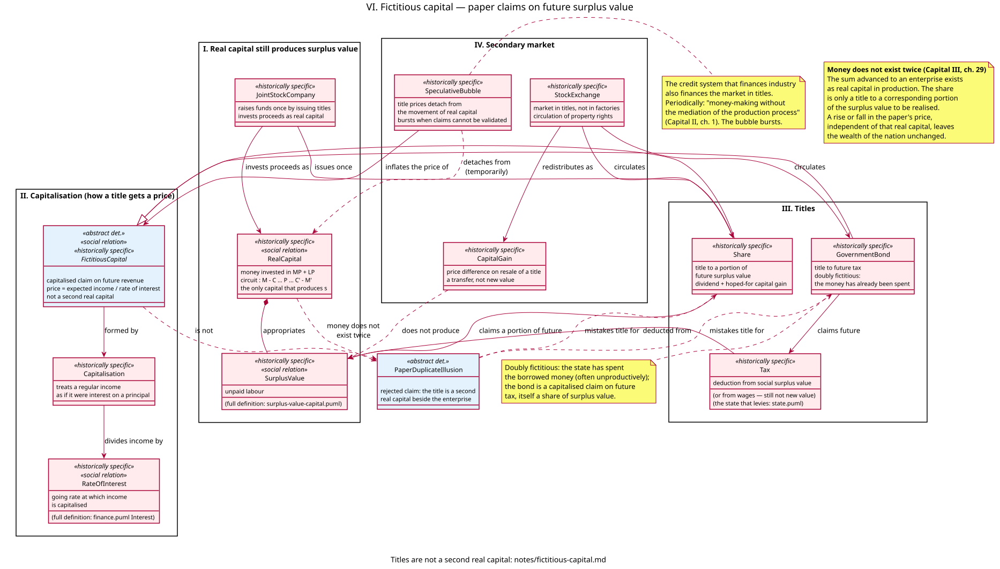

# Fictitious capital — model notes

Companion to [`models/fictitious-capital.puml`](../models/fictitious-capital.puml). Full stereotype legend: [stereotypes.md](stereotypes.md); every relationship in this diagram is indexed in [relationships.md](relationships.md). Presupposes [surplus-value.md](surplus-value.md) (`SurplusValue`, real capital as value that valorizes itself) and [finance.md](finance.md) (`Interest`, `RateOfInterest`, the credit system as intermediary). This increment does not remodel banking or the compulsion to accumulate.

This increment has one purpose: to show that shares, government bonds, and like titles are **capitalised claims** on future surplus value (or on tax, itself a share of that surplus). They are not a second real capital beside the factory, the workforce, or the state expenditure already made. A rise or fall in the paper’s price, independent of the real capital it notionally represents, leaves the wealth of the nation unchanged (Marx, *Capital* III, ch. 29). Fictitious capital redistributes claims among fractions of the capitalist class; it does not produce `s`.

---

## 1. What this increment models, and what it deliberately doesn't

It models:

- the distinction between `RealCapital` (money invested in means of production and labour-power, the only capital that produces surplus value) and `FictitiousCapital` (a capitalised title);
- `Capitalisation` as the operation that gives any regular income a notional principal (`price = expected income / rate of interest`);
- `Share` as a title to a portion of an enterprise’s future surplus value;
- `GovernmentBond` as doubly fictitious: a title to future `Tax` after the borrowed money has already been spent;
- the `StockExchange` as a market in titles, not in factories — the circulation of property rights;
- `CapitalGain` as a transfer on resale, not new value;
- `SpeculativeBubble` as the periodic attempt to make money without the mediation of the production process;
- `PaperDuplicateIllusion` as the rejected claim that the title is a second real capital.

It does **not** model derivatives and further layers of titles built on titles (except to note that they are the same relation iterated), the full credit cycle and crises as a concrete totality, quantitative easing, land as capitalised rent, or “financialisation” as a new mode of production that would dethrone surplus value. Those presuppose this increment.

---

## 2. The argument: a title is not a second factory

By `RealCapital` Marx means money-capital invested in physical means of production and labour-power to produce commodities for sale at a profit — the circuit already modelled as `M – C (LP + MP) … P … C′ – M′`. That is the only capital that produces surplus value.

`FictitiousCapital` does not transform money into commodities. It is a paper (or electronic) claim: a right to a future income stream, given a present price by capitalisation. Marx:

> The formation of a fictitious capital is called capitalisation.
> — *Capital* III, ch. 29

If a regular income is £1,000 a year and the going rate of interest is 5 percent, that income is treated *as if* it were interest on a principal of £20,000. The £20,000 need not exist as real capital. The title’s “capital-value” is illusory in that precise sense: it is a calculated shadow of an income, not a second sum standing beside the first.

A corporation may raise *real* funds by issuing shares. Those proceeds can be invested as `RealCapital`. The share that then circulates is not that capital again. Marx is explicit: the money does not exist twice — once as the capital-value of the titles and once as the actual capital invested. Real capital exists only in the latter form. The share is “a title of ownership to a corresponding portion of the surplus-value to be realised by it” (*Capital* III, ch. 29).

That is why `FictitiousCapital` does **not** inherit from `Capital` / `RealCapital` in the diagram. Inheritance would say the title *is a kind of* valorizing capital. The whole increment exists to deny that.

Interest-bearing capital lent to an enterprise that produces commodities is **not** fictitious capital as such (SPGB, “The rise of fictitious capital”). It is the relation already modelled in finance.md: money lent, a share of `s` paid as interest. The loan *becomes* the raw material of fictitious capital when it is packaged as a tradable title, or when it is advanced for something other than commodity production (consumer debt, the purchase of existing titles). The increment keeps that cut: `RealCapital` produces; `Share` claims; `Loan` (finance increment) intermediates.

---

## 3. Government bonds are doubly fictitious

A `GovernmentBond` is a title to future tax. Two things make it fictitious twice over:

1. Like any other title, its market price is a capitalisation of expected interest, not a sum of real capital in production.
2. Unlike a share, the money the state raised has typically already been spent — often unproductively (administration, war, interest on earlier debt). There is no factory whose surplus value the bond duplicates. The coupon is paid from `Tax`, and tax is a deduction from social surplus value (or from wages — still not a new source of value).

Marx: the money- or capital-value of such paper “does not represent capital at all, as in the case of national debts” (*Capital* III, ch. 29). The national debt is a claim on future production, not a second national wealth.

---

## 4. The secondary market redistributes; it does not produce

The `StockExchange` is “a market for fictitious capital… a market for the circulation of property rights as such.” After the initial issue, buying and selling shares does not put new means of production in motion. It transfers titles. `CapitalGain` is the price difference on that transfer — a redistribution among title-holders, not an increment of labour-time.

If every holder tried to sell at once and no one would buy, the paper’s price would fall toward zero. That thought-experiment (SPGB, “Has capitalism become financialised?”) is absurd as a market event, but it shows what the title *is*: a claim that has a price only while someone else will pay for the claim. It is not a machine.

`SpeculativeBubble` is the historically recurring state in which title prices detach from the movement of the real capital they notionally represent. Marx: nations “are periodically seized by fits of giddiness in which they try to accomplish the money-making without the mediation of the production process” (*Capital* II, ch. 1). Tulips, railway mania, the Dot-Com bubble, 2007–08: the credit system that finances industry also finances the market in titles. The bubble bursts when the capitalised claims cannot be validated in production. That bursting is not modelled here as a full theory of crisis; it is marked as the limit of autonomisation.

Autonomisation is real as a *tendency* — a buoyant stock market can coexist with a sluggish production of surplus value, because a different logic prices titles (expected future income, the rate of interest, liquidity). It is not real as a *new source*. Fictitious capital cannot permanently unshackle itself from real capital. Compound interest as a belief that paper grows by itself is, as the SPGB puts it, akin to alchemy.

---

## 5. Why this is not “financialisation” as a new mode of production

Some accounts treat the growth of securities as evidence that profit has been dethroned by interest, or the worker recast as a debt-peon rather than a wage-labourer. The SPGB’s objection, which this model follows, is that this would make financial profits something other than a subdivision of surplus value and would retire the theory of surplus value to the margin (“Has capitalism become financialised?”).

This increment refuses that. `Share --> SurplusValue : claims a portion of future` and `Tax --> SurplusValue : deducted from` are the only arrows that reach the source. `CapitalGain ..> SurplusValue : does not produce` is the denial. Layers of derivatives are the same claim iterated — titles on titles — not a new substance.

---

## 6. Classes

### `RealCapital`

The functioning capital of the surplus-value increment, named here to mark the contrast. Money in means of production and labour-power. Sole producer of `s`.

### `JointStockCompany`

The institutional form that raises funds *once* by issuing titles and invests the proceeds as real capital. After that issue, the titles circulate without a second investment.

### `FictitiousCapital`

Abstract determination: a capitalised claim on future revenue. Never exists on its own — it appears as a share, a bond, a packaged debt. Historically specific and a social relation: not a physical property of the certificate.

### `Capitalisation` and `RateOfInterest`

The pricing operation. Any regular income can be given a notional principal by dividing by the going rate of interest. That is why a fall in the rate of interest, other things equal, raises title prices without a single new machine being built.

### `Share`

Title to a portion of future surplus value (dividend) plus the hope of `CapitalGain` on resale. Not the factory.

### `GovernmentBond` and `Tax`

Title to future tax; tax as a deduction from social surplus value. Doubly fictitious (§3).

### `StockExchange`, `CapitalGain`, `SpeculativeBubble`

Circulation of titles; gain as transfer; periodic detachment from real capital and the burst.

### `PaperDuplicateIllusion`

Rejected claim, like `ThinAirTheory` and `SimpleReproduction`: the determination that the real relation rules out — that the title is a second real capital beside the enterprise.

---

## 7. Materialism, not paper metaphysics

- **A certificate is not a means of production.** It does not confront living labour. Workers do not work on share certificates; they work on materials, with instruments, under the command of whoever personifies the real capital.
- **Price of paper ≠ value of the nation.** Marx: to the extent that the paper’s depreciation or appreciation is independent of the actual capital, national wealth is as great after as before.
- **M–M′ on the secondary market conceals production; it does not replace it.** The desire to skip the “necessary evil” of the production process is periodic and real. It does not succeed as a system.
- **Reform of the stock exchange is not abolition of capital.** A society that still produces with wage-labour for sale, but with “better regulated” securities, still has real capital appropriating unpaid labour. The titles are a form of appearance of claims on that unpaid labour.

---

## 8. What is deferred

- Derivatives, CDOs, and other titles built on titles — the same capitalisation iterated.
- Land price as capitalised rent (a parallel operation; rent itself is not yet modelled).
- The full theory of crisis: overproduction, the breakdown of validation of claims, the choice between devaluing money and devaluing commodities.
- Quantitative easing as a concrete swap of titles for newly issued reserves.
- Bank capital as itself largely composed of these titles (*Capital* III, ch. 29) — noted, not drawn.
- “Financialisation” as a descriptive history of deregulation and floating rates after Bretton Woods (SPGB uses this history; this increment keeps the types, not the chronology).

---

## 9. Sources

**Marx**

- *Capital* II, ch. 1 — the production process as a “necessary evil” for money-making; periodic attempts to skip it.
- *Capital* III, ch. 29 — fictitious capital; capitalisation; money does not exist twice; national debt does not represent capital; paper’s price and national wealth.
- *Capital* III, ch. 30 — titles as accumulated claims on future production; the stock market as a gamble that appears to replace labour as the method of acquiring wealth.

**Socialist Party of Great Britain**

- “The rise of fictitious capital” (*Socialist Standard*, October 2023) — real vs fictitious capital; shares as titles, not a second capital; bank loans to commodity production are not fictitious as such; autonomisation and bubbles; fictitious capital redistributes `s`, does not create it.
- “Has capitalism become financialised?” (*Socialist Standard*, May 2025) — refusal of financialisation theories that would make financial profit something other than a subdivision of surplus value; the thought-experiment of every shareholder selling at once.
