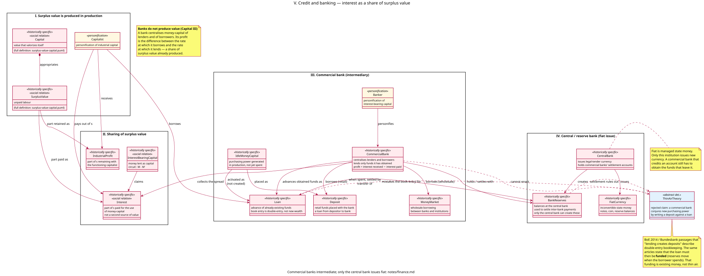

# Credit and banking — model notes

Companion to [`models/finance.puml`](../models/finance.puml). Full stereotype legend: [stereotypes.md](stereotypes.md); every relationship in this diagram is indexed in [relationships.md](relationships.md). Presupposes [surplus-value.md](surplus-value.md): `Capital`, `SurplusValue`, and `Capitalist` are used here as already defined there. Accumulation ([accumulation.md](accumulation.md)) is presupposed only in the weak sense that idle money-capital and borrowed funds are what mediate the reconversion of surplus value into additional capital; this increment does not remodel the compulsion to accumulate.

This increment has one purpose: to place finance in the system of wage-labour and capital as Marx and the Socialist Party of Great Britain (SPGB) present it. Banks do not produce value. They gather already-existing purchasing power and lend it. Interest is a share of surplus value produced by wage-labour. Only the reserve / central bank issues new fiat currency. Commercial banks do not, and cannot, create money “out of thin air.”

---

## 1. What this increment models, and what it deliberately doesn't

It models:

- the division of surplus value into `IndustrialProfit` and `Interest`;
- `InterestBearingCapital` as money lent as capital (Marx’s `M – M′`);
- the `CommercialBank` as a financial intermediary that centralises lenders and borrowers and lives on the interest spread;
- the sources of what a bank can lend: deposits (retail), the money market (wholesale), and its own capital;
- the `CentralBank` as the only issuer of new `FiatCurrency` and `BankReserves`;
- the funding / settlement constraint that rules out the claim that writing a loan-deposit pair creates new purchasing power.

It does **not** model the full credit cycle and crises, quantitative easing as a concrete central-bank operation, merchant’s capital, or the state as a tax-and-spend machine beyond its role in issuing fiat. Fictitious capital (shares, bonds, and other titles as capitalised claims on future surplus value) is modelled in [fictitious-capital.md](fictitious-capital.md).

---

## 2. The argument: a share of surplus value, not a second source

`SurplusValue` is unpaid labour, produced in the capitalist production process (surplus-value.md §7). Circulation realises it; circulation does not create it. Banking is a specialised circulation function. Marx:

> A bank represents on the one hand the centralisation of money-capital, of the lenders, and on the other hand the centralisation of the borrowers. It makes its profit in general by borrowing at lower rates than those at which it lends.
> — *Capital* III, ch. 25 (Penguin / Lawrence & Wishart paginations differ; SPGB cites p. 528 of the Progress/Lawrence edition)

Interest is therefore not a second source of value beside surplus value, and not a “special profit” that a bank conjures by writing numbers. It is the part of already-produced `s` paid for the use of money-capital. What remains with the functioning (industrial or commercial) capitalist is `IndustrialProfit`. Rent, tax, and merchant’s profit are further shares; they are deferred.

The same point is why a bank that “creates credit” in the thin-air sense would be a miracle: new purchasing power would appear in circulation without new value having been produced. Marx’s whole presentation of surplus value is a refusal of that miracle. Wealth and purchasing power arise in production (SPGB, *The Magic Money Myth*).

`InterestBearingCapital` is the form in which money is lent *as capital*. Its circuit is `M – M′` — money that returns with an increment — but the increment is not produced in that circuit. It is a claim on surplus value produced in `M – C … P … C′ – M′`. The shorter formula conceals the production of `s`; that concealment is itself a historically specific appearance, not a second origin.

---

## 3. How a commercial bank actually operates

A `CommercialBank` is a profit-seeking capitalist business. Its business model, in the bankers’ own description and in the SPGB’s restatement of it, is:

1. Obtain funds — from depositors (`Deposit`: legally a loan from the customer to the bank), from other institutions (`MoneyMarket`: wholesale funding), and from its own capital.
2. Retain a fraction as cash and as `BankReserves` at the central bank, enough to meet likely withdrawals and settlement.
3. Lend the rest as `Loan`.
4. Charge borrowers a higher rate than it pays for the funds. After wages and other costs of circulation, the remainder is banking profit — a share of surplus value.

That is intermediation. It is also what “fractional reserve banking” actually means when the phrase is used accurately: keep a fraction, lend the rest of *what you have*. It does **not** mean that a £100 deposit authorises the same bank to lend £900 or £9,900 out of nothing (SPGB, “Fractional Reserve Banking Refuted”; *The Magic Money Myth*).

`IdleMoneyCapital` is the material the bank works on: purchasing power already generated in production (wages, realised profits, depreciation funds, rents) that its owners do not want to spend immediately. The bank’s social role is to see that as little of that purchasing power as possible remains idle — by lending it to be spent. SPGB’s preferred verb is **activate**, not **create**.

Two empirical facts, used by the SPGB against the thin-air claim, sit in the diagram as `Deposit` and `MoneyMarket`:

- Banks that cannot attract or retain funds cannot keep lending. Northern Rock and HBOS failed in 2007–08 not because a magic wand broke, but because wholesale funding dried up or became more expensive than the interest they were receiving. Their loan-to-deposit ratios were well over 100%: they had been borrowing short on the money market to lend long. That is the behaviour of an intermediary that has over-reached, not of an institution that can write purchasing power at will.
- A credit union, a building society, or any other lender that advanced more than it had obtained would be bankrupt. The same arithmetic applies to a bank. The difference is that a bank has access to the money market and, in a crisis, to the central bank as lender of last resort — still *funding*, still existing money, still not thin air.

---

## 4. Only the central bank issues new fiat

`FiatCurrency` is inconvertible state money: notes, coin, and the reserve balances the central bank records for commercial banks. It comes into being at the will of the state (Latin *fiat*). That is a historically specific determination of `Money` as already modelled (surplus-value.md §6): money remains the independent form of appearance of value; under modern capitalism that form is no longer a gold commodity circulating at its own value, but a token the state must *manage*.

`CentralBank` is the institution that issues that currency and holds commercial banks’ settlement accounts. `BankReserves` are balances in those accounts. **Only the central bank can create them.** When a borrower spends a newly credited loan at another bank, the lending bank settles by transferring reserves. If it has no reserves and cannot attract deposits or wholesale funds, the payment does not go through.

This is the precise sense of the increment’s claim: commercial / trading / retail banks do not and cannot create money out of thin air; the reserve / central bank can issue new fiat. The two must not be collapsed. “The banking system including the central bank can expand credit” is a different, and much weaker, statement than “Barclays creates pounds by typing.”

---

## 5. Why the BoE and Bundesbank passages are misread

In 2014 the Bank of England Quarterly Bulletin published “Money creation in the modern economy” (McLeay, Radia, Thomas). The Deutsche Bundesbank has made similar remarks about “book money.” Steve Keen and other endogenous-money writers treat these as official proof that commercial banks create money out of nothing.

The SPGB’s reading, which this model follows, is that those passages are being **misquoted by selective emphasis**.

What the BoE article actually does:

1. It redefines “money” to include bank deposits (broad money, M4), not only notes, coin, and reserves (base money, M0). Once “bank credit” is *called* money, then “banks create money when they lend” is true **by definition**: a loan and a matching deposit are the same bookkeeping event.
2. In the same article it describes that event as double-entry bookkeeping: the bank records a new asset (the borrower’s IOU) and a new liability (the credited account). That is what Werner filmed at a Bavarian bank and announced as “the first empirical demonstration in 5,000 years” that banks create fairy dust. It demonstrates that banks keep books.
3. Later in the same article — the part the thin-air school under-quotes — the authors state that when the borrower *spends*, the lending bank “settles with the seller’s bank by transferring reserves,” and that “whether through deposits or other liabilities, the bank would need to make sure it was attracting and retaining some kind of funds to keep expanding lending” (their emphasis).

So the famous sentence “bank lending creates deposits” names a ledger pairing. It does not name the creation of new purchasing power independent of funds. The Bundesbank’s “banks can create book money just by making an accounting entry” is the same pairing; the same Monthly Report notes that a bank “still has to fund the loans it has created” because it needs central-bank reserves to settle transfers.

`ThinAirTheory` in the diagram is that rejected collapse: treating the book entry as if it were the central bank’s fiat issue. It is marked `{abstract}` because it is a determination that does not exist in the real relation — a contrast class, like `SimpleReproduction` in the accumulation increment or `SimpleCommodityProduction` in the surplus-value increment.

Keen’s models (and the phrase “money from nothing”) start from that collapse. They are not used here as a source. The project’s constraint remains: Marx and the SPGB, not a heterodox reconstruction of Marx via endogenous-money theory.

---

## 6. Classes

### `Interest` and `IndustrialProfit`

Two parts of one surplus value. `Interest` is paid for the use of money-capital; `IndustrialProfit` is what remains with the capitalist who actually sets labour-power and means of production to work. Neither is a source. The source is unpaid labour.

### `InterestBearingCapital`

Money advanced on condition of a return `M – M′`. Historically specific and a social relation: the same sum is not interest-bearing capital if it is spent as revenue, or if it is advanced by the functioning capitalist as their own industrial capital. It becomes this type only when it is *lent*.

### `CommercialBank` and `Banker`

The bank is the institutional form of the centralisation Marx describes. The `Banker` is a personification, like `Capitalist`: the compulsion to lend at a spread, and the inability to lend what the bank has not obtained, attach to the role, not to a psychology of “banksters.”

### `IdleMoneyCapital`, `Deposit`, `MoneyMarket`, `Loan`

The four moments of intermediation. Idle money generated in production is placed as a deposit or obtained wholesale; the bank advances it as a loan. The loan’s book entry is double-entry, not new wealth. When spent, it is settled in reserves.

### `CentralBank`, `FiatCurrency`, `BankReserves`

The only place in the model where new currency is issued. Reserves are the settlement medium commercial banks cannot print.

### `ThinAirTheory`

Rejected claim, not a real social form. Present so the increment can show *what it denies* as a typed object, rather than only in prose.

---

## 7. Materialism, not monetary metaphysics

The same refusals as surplus-value.md §3, applied to finance:

- **Banks produce no value.** Their labour is a cost of circulation. It shortens turnover and concentrates funds; it does not add a new increment of labour-time to the product.
- **A ledger is not a product.** Increasing both sides of a balance sheet does not increase social wealth. If it did, no bank would ever fail.
- **Fiat is still money as the form of value.** Inconvertibility does not make the central bank a creator of value, only of tokens that circulate as the independent form of appearance of value. The need for those tokens still originates in production and exchange.
- **Reform of banking is not abolition of capital.** Even a 100-percent-reserve or “public” bank that still lent existing funds at interest, to capitals producing for sale with wage-labour, would remain inside this increment’s types. The problem is not that banks have a magic wand. It is that the means of life are monopolised as capital.

---

## 8. What is deferred

- Derivatives and further layers of titles — the same capitalisation iterated ([fictitious-capital.md](fictitious-capital.md) models the share and the government bond).
- The credit cycle, overtrading, and crises as the point at which claims cannot be validated in production.
- Quantitative easing and other concrete central-bank operations (asset purchases that swap one existing asset for newly issued reserves).
- Merchant’s capital as a full circuit beyond the commercial share of the average rate (that share is in [prices-of-production.md](prices-of-production.md)).
- The state as taxer, borrower, and spender — beyond its role here as the backer of fiat.
- Rent as a further share of redistributed surplus value. How industrial and commercial profit tend toward one average rate is modelled in [prices-of-production.md](prices-of-production.md).

---

## 9. Sources

**Marx**

- *Capital* III, ch. 21–24 — interest-bearing capital; interest as a part of profit; the circuit `M – M′`.
- *Capital* III, ch. 25 — the role of credit; the bank as centralisation of lenders and of borrowers; banking profit as the interest spread.
- *Capital* III, ch. 29–32 — bank capital, deposits, and the distinction between money and claims on money (used here only so far as needed to keep a deposit an IOU, not a newly minted value).
- *Capital* I, ch. 3 — money as the necessary form of appearance of value (already modelled; fiat is a more concrete determination of that form).

**Socialist Party of Great Britain**

- *The Magic Money Myth* (2019 pamphlet) — banks as intermediaries; “activate” versus “create”; close reading of BoE 2014 (loans must be funded); critique of Werner, Graeber, and the thin-air school.
- “Fractional Reserve Banking Refuted” (*Socialist Standard*, October 2012) — crude and “whole-system” credit-creation theories; Marx on the bank; Northern Rock / HBOS as evidence that banks need funds.
- “The myth of magic money” (*Socialist Standard*, December 2008) — the cash-ratio misunderstanding (10% reserve does not mean a bank lends 9× a deposit).
- “Where Money Comes From: A Reply to the New Economics Foundation” (*Socialist Standard*, February 2012) — banks have no “special profits” from issuing credit; the spread is ordinary banking profit, a share of surplus value.

**Not used as sources (explicitly refused)**

- Steve Keen, and the endogenous-money / “loans create deposits therefore banks create money from nothing” reading of the Bank of England (2014) and Deutsche Bundesbank texts. Those central-bank articles are cited only as the documents being misread, via the SPGB’s commentary.
