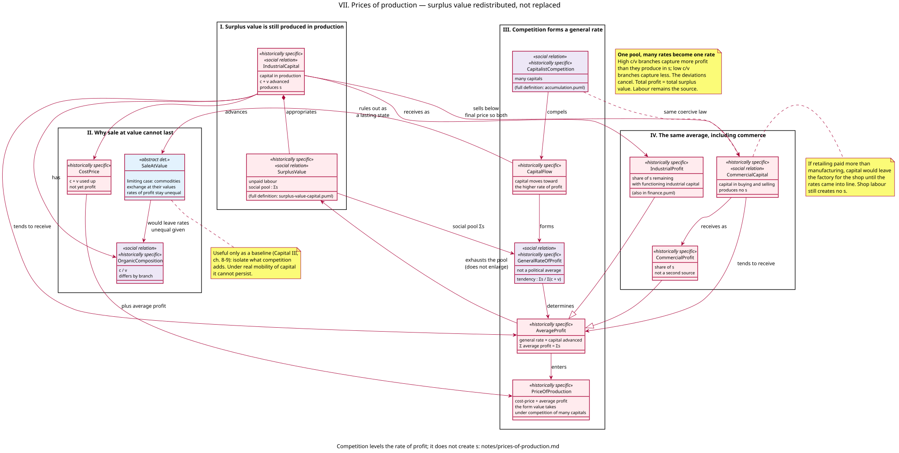

# Prices of production — model notes

Companion to [`models/prices-of-production.puml`](../models/prices-of-production.puml). Full stereotype legend: [stereotypes.md](stereotypes.md); every relationship in this diagram is indexed in [relationships.md](relationships.md). Presupposes [surplus-value.md](surplus-value.md) (`c`, `v`, `s`, `s/v`, `s/(c+v)`), [accumulation.md](accumulation.md) (`CapitalistCompetition` as coercive law), and [finance.md](finance.md) (interest and industrial profit as shares). Commercial profit is named here; merchant’s capital as a full circuit is still only so far as needed for the average rate.

This increment has one purpose: to show that competition among many capitals forces a **general rate of profit** and **prices of production**, and that this only **redistributes** surplus value already produced by unpaid labour. The merchant is not in a position to earn a permanently higher rate than the manufacturer. Shop labour still creates no `s`.

---

## 1. What this increment models, and what it deliberately doesn't

It models:

- why sale of commodities **at their values** would leave unequal rates of profit wherever `OrganicComposition` (`c/v`) differs by branch;
- `CapitalFlow` under `CapitalistCompetition` toward the higher rate, ruling `SaleAtValue` out as a lasting state;
- `GeneralRateOfProfit` as the tendency `Σs / Σ(c+v)` — not a figure a government could choose;
- `AverageProfit` as that rate times capital advanced, with `Σ` average profit = `Σs`;
- `PriceOfProduction` as cost-price plus average profit — the form value takes once many capitals compete;
- `CommercialCapital` taking the **same** average on the capital it advances, via `CommercialProfit` as a share of `s`;
- the industrial capitalist selling to the merchant below the final selling price so both rates tend into line.

It does **not** model market prices oscillating around prices of production, the tendency of the rate of profit to fall (*Capital* III, Part 3), land and rent, a full “transformation problem” debate, or equalization on the world market. Those presuppose this increment.

---

## 2. The argument: one pool, a common rate

If every commodity sold at its value, the rate of profit `s/(c+v)` would differ by branch even if the rate of exploitation `s/v` were the same everywhere. A branch that lays out relatively more on means of production (high `c/v`) would show a lower rate on the total capital advanced. Capital does not tolerate that. It flows toward the branches with the higher rate. Supply rises there and prices fall; the neglected branches see the opposite. The movement continues until a **general rate** is formed as a tendency.

Commodities then sell at **prices of production**: `CostPrice` (`c+v` used up) plus `AverageProfit`. Individual prices now diverge from individual values. Branches with high organic composition capture *more* profit than the surplus value produced in that branch; labour-intensive branches capture *less*. The deviations cancel. **Total profit = total surplus value.** Nothing in circulation has added a new increment of labour-time.

That is the same discipline as the finance increment (interest is a share) and the fictitious-capital increment (a title is a claim, not a second factory). Competition changes the *form of appearance* of value (price of production instead of value), not the *source*.

`SaleAtValue` is a contrast class, like `SimpleReproduction` and `ThinAirTheory`: a limiting case Marx uses to isolate what competition adds (*Capital* III, ch. 8–9), immediately negated once capital is mobile.

The general rate is **not a political average**. No board sets `Σs / Σ(c+v)`. It is the same kind of external coercive law as “accumulate or be eliminated” ([accumulation.md](accumulation.md) §2), now applied to the *rate* rather than to the compulsion to reinvest.

---

## 3. Commercial capital takes the same average

If retailing regularly returned more on the capital advanced than manufacturing, capital would leave the factory for the shop until the rates came into line (and the reverse). So the merchant is *unlikely* to make a permanently higher rate than the manufacturer. That is not a moral equilibrium; it is `CapitalFlow` again.

Therefore industrial capital sells to commercial capital **below** the final selling price, leaving a margin such that, on the merchant’s own capital (stock, premises, wages of clerks), the rate tends toward the same general rate. `CommercialProfit` is that share. It is a form of `AverageProfit`, not a second surplus.

Shop and wholesale labour still create no `s`. Those workers perform unpaid labour that cheapens the *realisation* of surplus value already produced (including surplus produced abroad and imported). The leveling explains why that unpaid commercial labour does not show up as a higher long-run rate for the merchant: extra commercial profit would attract capital until the average is restored.

Interest remains a further cut of the same average profit (profit of enterprise versus interest), as in [finance.md](finance.md). This increment does not redraw that split; it only locates both industrial and commercial profit on the average.

---

## 4. Worked example (three branches)

Assume the whole of `c` and `v` is used up in the period, and the same rate of exploitation `s/v` = 100% in each branch.

| Branch | `c` | `v` | `s` produced | Value (`c+v+s`) | Rate if sold at value |
| --- | --- | --- | --- | --- | --- |
| A (high composition) | 90 | 10 | 10 | 110 | 10% |
| B | 80 | 20 | 20 | 120 | 20% |
| C (low composition) | 70 | 30 | 30 | 130 | 30% |
| **Social totals** | **240** | **60** | **60** | **360** | — |

Total capital advanced = 300. General rate = 60 / 300 = **20%**. Average profit on each 100 of capital = 20. Cost-price in each branch = 100. Price of production in each = **120**.

| Branch | `s` produced | Average profit received | Price of production | Deviation |
| --- | --- | --- | --- | --- |
| A | 10 | 20 | 120 | +10 |
| B | 20 | 20 | 120 | 0 |
| C | 30 | 20 | 120 | −10 |
| **Totals** | **60** | **60** | **360** | **0** |

A’s capitalists receive more profit than they extracted as unpaid labour; C’s receive less. The social pool is unchanged. Labour remains the source; competition has only reallocated the pool in proportion to capital advanced.

If a commercial capital of 100 now handles the sale of these commodities, the social capital is 400 and `Σs` is still 60. The general rate falls to 15%. Industrial capital tends to receive 45 on 300; commercial capital 15 on 100. The manufacturers sell to the merchants at a total of 345 (cost 300 + industrial average profit 45); the merchants sell at 360. The extra 15 is commercial profit — a share of the same 60, not a product of shop labour. (Figures are schematic, in the spirit of the SPGB 1962 surplus-value example.)

---

## 5. Classes

### `OrganicComposition`

`c/v` as a value-expression of the technical relation between means of production and labour-power. Already an operation on `Capital` in surplus-value-capital.puml. Here it is the reason sale at value cannot last.

### `CostPrice`

`c+v` used up — what the capitalist must recover before there is any profit. Not a source of profit.

### `SaleAtValue`

Abstract limiting case. Rates stay unequal given different compositions. Ruled out by `CapitalFlow`.

### `CapitalFlow`

The movement of capital toward the higher rate. The mechanism that *is* the leveling.

### `GeneralRateOfProfit`

Tendency `Σs / Σ(c+v)`. Historically specific and a social relation: it exists only because many capitals compete and because `s` is a social pool.

### `AverageProfit` and `PriceOfProduction`

Profit as a share of the pool proportional to capital advanced; the price that corresponds to that. `AverageProfit --> SurplusValue : exhausts the pool (does not enlarge)` is the increment’s load-bearing denial.

### `IndustrialCapital`, `CommercialCapital`, `IndustrialProfit`, `CommercialProfit`

Both capitals tend to receive average profit on what they advance. Commerce produces no `s`. Inheritance of the two profits from `AverageProfit` marks them as forms of the same average, not as independent sources.

---

## 6. Materialism, not a theory of fair prices

- **The average is not justice.** Equal profit on equal capital is what mobile capitals enforce. It is not a claim that each capitalist “deserves” a share, and not a policy that could be repealed while capital remains mobile.
- **Price of production is still a form of value.** It is value after the competition of many capitals has been taken into account — more concrete than the simple value of *Capital* I, not a replacement of labour-time by “supply and demand” as origin.
- **Imported goods do not break the rule.** NZ commercial capital tends toward the average on *its* capital; the `s` it realises may have been produced elsewhere. Shop labour in the importing country still creates no surplus value.
- **Reform of prices is not abolition of surplus value.** A regulated “fair” mark-up still presupposes unpaid labour in production and capitals competing for a share of it.

---

## 7. What is deferred

- Market prices as fluctuations around prices of production.
- The tendency of the rate of profit to fall as the average organic composition rises (*Capital* III, ch. 13–15).
- Ground rent and the price of land as a further cut / capitalisation.
- The academic “transformation problem” as a closed algebraic dispute — this increment keeps Marx’s and the SPGB’s qualitative claim: the pool is conserved; the form changes.
- Equalization on the world market; transfer pricing; why a national average may sit inside a messier international one.
- Crises, when prices of production cannot be realized.

---

## 8. Sources

**Marx**

- *Capital* III, ch. 8–10 — different compositions; formation of a general rate of profit; prices of production; the identity of total profit and total surplus value.
- *Capital* III, ch. 16–18 — commercial capital and commercial profit as a share; commercial workers produce no surplus value; commerce participates in the average rate.
- *Capital* I, ch. 9 (and the SPGB 1962 example) — `s/v` versus `s/(c+v)` as different ratios.

**Socialist Party of Great Britain**

- “An introduction to Marxian economics 2: the rate of profit” — average rate; profit as redistributed surplus value.
- “What is surplus value” (*Socialist Standard*, December 1962) — the numerical distinction between rate of exploitation and rate of profit, which this increment generalises across branches.
- The case that shop, bank, and tax are not second sources of surplus value — already used in [surplus-value.md](surplus-value.md) §7; here applied to the leveling of commercial and industrial rates.
