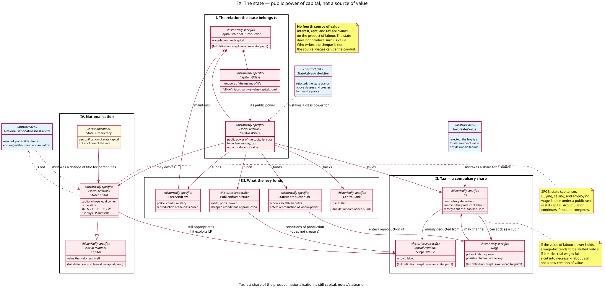

# The capitalist state — model notes

Companion to [`models/state.puml`](../models/state.puml). Full stereotype legend: [stereotypes.md](stereotypes.md); every relationship in this diagram is indexed in [relationships.md](relationships.md). Presupposes [surplus-value.md](surplus-value.md) (`SurplusValue`, `Wage`, the class relation), [accumulation.md](accumulation.md) §5 (nationalisation does not suspend the compulsion to accumulate), [finance.md](finance.md) (`CentralBank`, fiat), and [fictitious-capital.md](fictitious-capital.md) (`Tax` as the income a government bond claims). This increment does not remodel banking, titles, or the general law of accumulation.

This increment has one purpose: to place the state in the system of wage-labour and capital as Marx and the Socialist Party of Great Britain (SPGB) present it. The state is the **public power of the capitalist class**, not a neutral referee and not a producer of value. Tax is a compulsory share of the product of labour (mostly surplus value; sometimes a cut into the wage). Nationalisation changes who personifies capital; it does not abolish wage-labour, commodities, or accumulation.

Marx never wrote the planned book on the state. The increment is therefore more SPGB-heavy than earlier ones, and it stays inside what the value theory already requires: no fourth source of `s`, no policy that could abolish the class relation while leaving it in place.

---

## 1. What this increment models, and what it deliberately doesn't

It models:

- `CapitalistState` as the public power of the `CapitalistClass` — force, law, money, tax — belonging to the `CapitalistModeOfProduction`, not standing above it;
- `Tax` as a compulsory deduction whose *source* is the product of labour (mainly `s`; able to stick in `v`), while the wage may be only the *channel*;
- what the levy funds: `ForceAndLaw` (reproduction of the class order), `PublicInfrastructure` (cheapening conditions of production, not a creation of `s`), `StateReproductionOfLP` (schools, health, benefits entering the reproduction of labour-power), and the backing of the `CentralBank` already modelled in finance;
- `StateCapital` as capital whose legal owner is the state — still `M – C … P … C′ – M′` if it buys labour-power and sells;
- `StateBureaucracy` as personification of that capital, the same stereotype as `Capitalist`;
- three contrast classes: `StateAsNeutralArbiter`, `TaxCreatesValue`, `NationalisationAbolishesCapital`.

It does **not** model the origins of the state from the family or from the split of society into classes (Engels’s historical sketch), the world market or imperialism, crises as a concrete totality, or ground rent. Rent remains a further share of surplus value, Marx’s trinity of profit/interest/rent; tax is a fourth *claim*, via the state, not a fourth *source*. Those presuppose this increment.

---

## 2. The argument: a class power, not a referee

The capitalist mode of production is already a class monopoly of the means of life plus wage-labour plus production for surplus value (surplus-value.md §7). That monopoly is not self-enforcing as a mere bargain between individuals. It needs a public power: a force that is not any one firm’s security department, a law that defines property and contract, a money that is legal tender, a levy that funds the apparatus.

Marx, in a sentence the SPGB repeats because it is the political counterpart of the personification already modelled:

> The executive of the modern state is but a committee for managing the common affairs of the whole bourgeoisie.
> — *Manifesto of the Communist Party*, I

“Committee” is the point. The state manages affairs that no single capital can manage for the class: the legal form of property, the currency, the reserve of force, the conditions of a labour-power market. It does that *for the class*, not instead of the class, and not as a third party that could choose a different mode of production by an act of will. `CapitalistClass --> CapitalistState : its public power` is that claim. `StateAsNeutralArbiter` is the rejected opposite: the state as standing above classes and manufacturing fairness by policy.

The state does not thereby become a producer of value. Public employees who draft statutes, police streets, or keep the books of the Treasury perform useful (or destructive) labour from the standpoint of the class order. They do not produce surplus value. Surplus value is unpaid labour in the capitalist production process (surplus-value.md §7). Circulation, administration, and coercion realise, protect, and redistribute it. They do not add a new increment of labour-time to the commodity as value.

That is the same cut already drawn for the shop clerk, the bank clerk, and the title-holder. The tax office is not a fourth factory.

---

## 3. Tax: source and channel are not the same

`Tax` is a compulsory deduction. It is not interest (a contractual share for the use of money-capital) and not rent (a share for landed title). It is a deduction the public power can enforce. What it is *not* is a source of value. `TaxCreatesValue` is the rejected claim.

Two distinctions keep the type from collapsing into either “all tax is stolen wages” or “workers never pay tax.”

**Source.** The only source of new value is living labour. The social product divides into the replacement of constant capital, the value of labour-power, and surplus value. A tax must come out of that product. In the ordinary run of capitalist taxation — taxes on profits, on property, on capital gains, the interest the state pays on bonds from future levies — the cut is a cut of `s`. Corporation tax is openly a share of surplus value. The coupon on a `GovernmentBond` (fictitious-capital.md §3) is paid from tax, and that tax is still not a new creation.

**Channel.** Who writes the cheque is not the source. A tax collected as a deduction from the wage uses the wage as a conduit. If the value of labour-power holds — if the worker must still be reproduced at the historically given standard — a wage-tax tends to be shifted onto surplus value: money-wages rise, or the capitalist class pays the levy in another form. If the tax *sticks*, real wages fall. That is a cut into necessary labour, a change in the rate of surplus value, still not a fourth origin of value. `Wage --> Tax : may channel` and `Tax --> Wage : can stick as a cut in` are those two possibilities. Neither arrow produces `s`.

Unlike interest and rent, the levy is not only a private claim. It funds the reproduction of the class order itself. Some of that spending returns as means of reproducing labour-power (`StateReproductionOfLP`: schools, health, benefits). Some cheapens the conditions under which capitals produce (`PublicInfrastructure`: roads, ports, power — a cheapening of elements of `c`, not a creation of `s`). Some is the unproductive cost of force and law. The *use* of the share does not turn the share into a product.

---

## 4. What the levy funds

`ForceAndLaw` is the core of a public power: police, courts, military. It reproduces the class order. Without that maintenance the class monopoly of the means of life is only a claim.

`PublicInfrastructure` is not “the state creating value by building things.” A road is a use-value; under capitalism it is typically a condition of production that many capitals use and that no one capital will supply at the required scale. Cheapening transport cheapens elements of constant capital and shortens circulation. The surplus value still originates in unpaid labour in production.

`StateReproductionOfLP` enters the reproduction of labour-power. Public education and health are, from capital’s standpoint, part of how the historically given labour-power is produced — the “historical and moral element” already in the value of labour-power (surplus-value.md §7). They can lower what the individual capitalist must pay as a wage, or raise the quality of the labour-power on offer. They do not abolish labour-power as a commodity.

`CentralBank` is recapped, not remodelled. The state backs the issuer of fiat ([finance.md](finance.md) §4). Issuing tokens is not producing value; it is managing the independent form of appearance of value.

Governments can tighten or loosen the reserve army (public works, unemployment insurance) — already noted in [concentration.md](concentration.md) §4. They cannot abolish the form while production remains the accumulation of capital. This increment supplies the public power that does the tightening; it does not make unemployment a policy error.

---

## 5. Nationalisation is still capital

A government that takes legal title to a firm, a mine, or a chain of shops has changed the *personification*. It has not, by that fact, abolished capital.

`StateCapital` inherits from `Capital`: value that valorizes itself. If the unit still buys labour-power, still owns the product, still sells commodities, the circuit is still `M – C … P … C′ – M′`. Unpaid labour is still appropriated. `StateBureaucracy` occupies the role `Capitalist` occupied — the same stereotype, a different costume. Replace the private board with a ministry; the compulsion to accumulate still falls on the unit if it competes for markets, investment, or resources ([accumulation.md](accumulation.md) §5).

That is the SPGB’s **state capitalism**: state ownership plus wage-labour plus commodity production. The USSR, postwar nationalised industries, a municipal shop, a compulsory public grocery chain — the legal seal differs; the types do not. `NationalisationAbolishesCapital` is the rejected claim that public title deeds end the relation.

Incumbents who defend their titles (compensation, investment strike, capital flight) are defending fictitious and real claims already modelled. The increment does not need a separate “sabotage” class. Those are the behaviour of capitals and title-holders under competition, facing a change of personification they do not want.

What would abolish the types is the same change already named in accumulation.md §5: production no longer organised as independent units of capital employing wage-labour for sale. That is a change of mode of production, not a change of the name on the title.

---

## 6. Classes

### `CapitalistState`

Historically specific and a social relation: not the buildings, and not a transhistorical “political community.” Public power of the capitalist class — force, law, money, tax. Not a producer of value.

### `Tax`

Compulsory deduction from the product of labour. Mainly a cut of `s`; can stick as a cut in `v`. Introduced as the income a bond claims in [fictitious-capital.md](fictitious-capital.md); defined here as a relation of the state.

### `ForceAndLaw`, `PublicInfrastructure`, `StateReproductionOfLP`

Three uses of the levy. Coercion; cheapening of conditions of production; reproduction of labour-power. None of them is a factory of surplus value.

### `CentralBank` (recap)

Issuer of fiat. Full definition in [finance.md](finance.md).

### `StateCapital` and `StateBureaucracy`

Capital under public title; the bureaucracy as its personification. Inheritance from `Capital` is the load-bearing claim: the unit *is a kind of* valorizing capital, not a step outside it.

### `StateAsNeutralArbiter`, `TaxCreatesValue`, `NationalisationAbolishesCapital`

Contrast classes, like `ThinAirTheory` and `UnemploymentAsPolicyFailure`. Neutral referee; tax as a fourth source; public deeds as abolition. The real relations rule all three out.

---

## 7. Materialism, not a theory of the good state

- **Not a referee above classes.** Policy that assumes a standpoint outside wage-labour and capital is `StateAsNeutralArbiter`. The types do not include a classless “public interest” that could choose accumulation or not.
- **Not a producer.** The state spends value already produced. Printing tokens ([finance.md](finance.md)) and levying tax do not add labour-time to commodities.
- **Not “workers pay all tax” and not “workers pay none.”** Source and channel are different arrows. A wage-tax that sticks is a cut into `v`; it is still not a new `s`.
- **Not nationalisation as socialism.** Changing who personifies capital does not abolish the role. The SPGB’s case against reformism is this increment’s `StateCapital --|> Capital`.
- **Not the origins of political authority.** How public power arose from the family and from the split into classes is a different concrete (Engels). This increment starts from the capitalist state as it belongs to this mode of production.

---

## 8. What is deferred

- Ground rent and the price of land as a further cut / capitalisation of surplus value.
- The world market, the state system of many states, imperialism.
- Crises as a concrete totality (including the state’s role as lender of last resort beyond the central bank already in [finance.md](finance.md), and as manager of bankruptcies).
- The tendency of the rate of profit to fall (*Capital* III, Part 3).
- Reproduction schemas (Departments I and II).
- The historical origins of the state; the “withering away” of public power in a classless society — named only as the implication that this type is historically specific.

---

## 9. Sources

**Marx and Engels**

- *Manifesto of the Communist Party*, I — the executive as a committee of the bourgeoisie.
- *Capital* I, ch. 10 — the Factory Acts: the state as the form in which a limit on the working day is imposed, still inside the class relation, not as a neutral gift.
- *Capital* III, ch. 29 — tax and the national debt as claims on future production, not a second national wealth (already [fictitious-capital.md](fictitious-capital.md)).
- *Critique of the Gotha Programme* — the state as a machine with an economic basis in tax; “free state” as a slogan that does not specify the class content.
- Engels, *The Origin of the Family, Private Property and the State*, IX — the state as a public power standing apart from the population, arising with class society. Used here only for *what* that power is under capitalism, not for the historical derivation (deferred).

**Socialist Party of Great Britain**

- *An A–Z of Marxism*, “State,” “State Capitalism,” “Reformism” — the state as a class machine; nationalisation and the USSR as state capitalism; reform as a change of terms, not of the relation.
- The case against reformism already used in [accumulation.md](accumulation.md) §5: changing the legal personification of capital does not remove the compulsion to accumulate.
- The running claim, already in [surplus-value.md](surplus-value.md) §7, that the worker is not exploited “again” by the tax-collector as a second source of surplus value: tax is a share of the product of labour.
