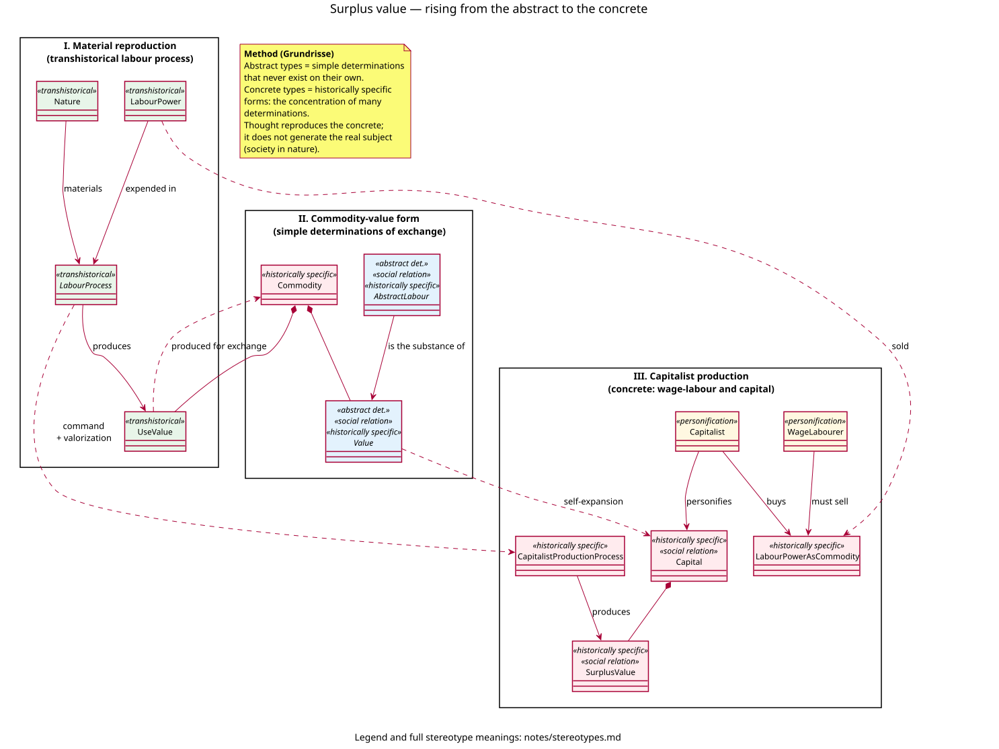
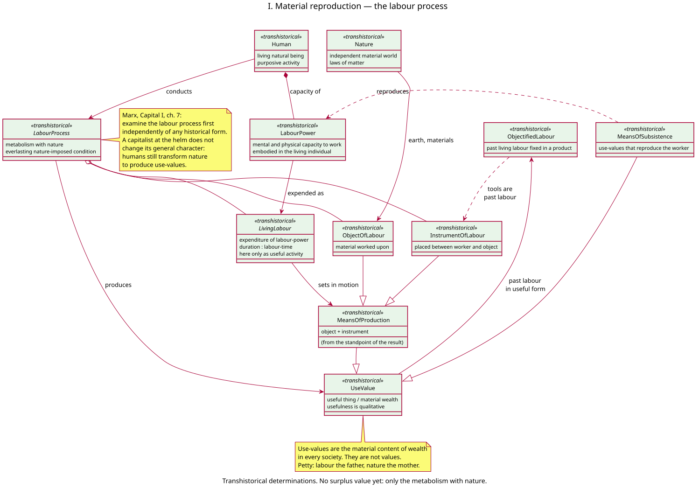
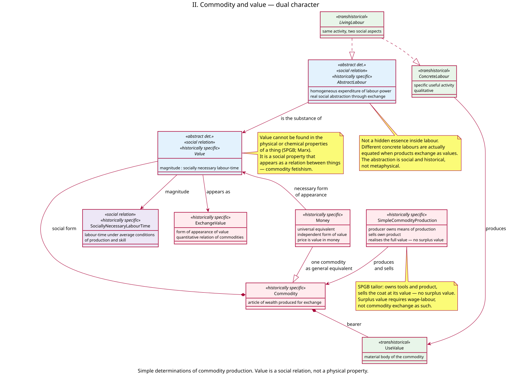
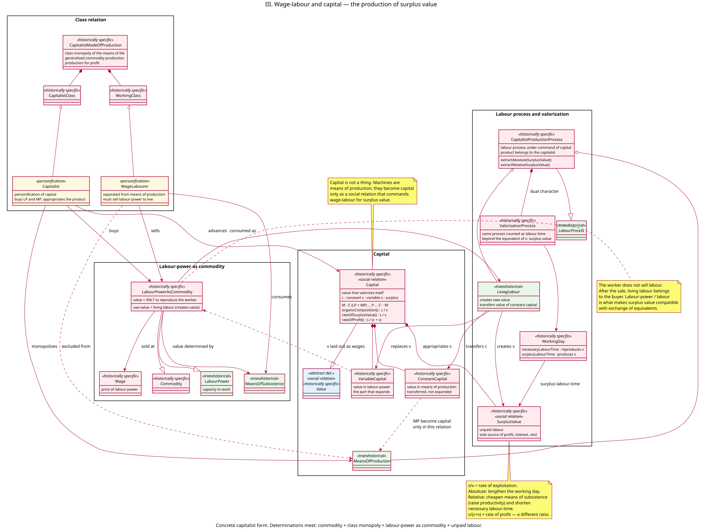

# Surplus value — model notes

Companion to four PlantUML source files: [overview](../models/surplus-value-overview.puml), [labour process](../models/surplus-value-labour-process.puml), [commodity](../models/surplus-value-commodity.puml), [capital](../models/surplus-value-capital.puml). Rendered images are embedded below each section and under [`models/rendered/`](../models/rendered/). Every relationship in these diagrams is indexed in [relationships.md](relationships.md); stereotypes are defined in [stereotypes.md](stereotypes.md).

These notes record what each type *is* in Marx’s materialist presentation, how abstract and concrete are used as modelling devices, and what is deliberately left out. They are not a substitute for *Capital*. They follow Marx, with the Socialist Party of Great Britain (SPGB) as a running check against both academic price theory and metaphysical readings of “value.”

---

## 1. What this increment models

Capitalism, in the sense used here, is a historically specific social system: class monopoly of the means of life, generalised commodity production, and the exploitation of wage-labour for surplus value (SPGB, *What is Capitalism?*; *An A–Z of Marxism*, “Capitalism”).

This increment models only the **theory of (surplus) value**: how material wealth takes the commodity form; how value is a social relation measured by socially necessary labour-time; how labour-power becomes a commodity; and how unpaid labour appears as surplus value, the sole source of profit, interest, and rent.

It does **not** yet model the state or the world market. Those are more concrete determinations. They presuppose this model; they do not replace it.

A second increment, [accumulation of capital](accumulation.md), builds directly on `Capital` and `SurplusValue` as defined here: it introduces competition among many capitals only so far as needed to show that accumulation is a compulsion, not a choice. It does not yet model the further consequences of competition (concentration and centralisation of capital, the reserve army of labour). Equalisation of profit rates and prices of production are modelled in [prices-of-production.md](prices-of-production.md).

A third increment, [credit and banking](finance.md), places finance in the same system: interest is a share of surplus value; commercial banks intermediate already-existing funds; only the central bank issues new fiat.

A fourth increment, [fictitious capital](fictitious-capital.md), distinguishes real capital from capitalised titles (shares, government bonds): the paper is a claim on future surplus value, not a second factory.

A fifth increment, [prices of production](prices-of-production.md), shows that competition levels the rate of profit across industrial and commercial capital and only redistributes the pool of surplus value.

---

## 2. Abstract and concrete — why this is an object model

Marx uses “abstract” and “concrete” in two related ways. Both are useful for class modelling; they must not be collapsed into one.

### 2.1 Method of presentation (Grundrisse)

The scientifically correct method is to rise from simple determinations to the concrete as a “rich totality of many determinations and relations.” The concrete is concrete *because* it concentrates many determinations. In thought it appears as a result. In reality it is the starting point.

That maps onto types:

| Marx | Object model |
| --- | --- |
| Simple, one-sided determination (value, labour process as such) | Abstract type — cannot “exist alone” |
| Historically specific form that concentrates determinations | Concrete type |
| Dual character of one process | Composition or two aspects of one instance |
| Form of appearance | Association, not identity |
| Personification of a class relation | Instance of a role type |

The PlantUML stereotypes that mark these distinctions (`historically specific`, `transhistorical`, `abstract det.`, and the rest) are defined in [stereotypes.md](stereotypes.md).

The movement of categories is **not** the process by which the concrete comes into being. Marx is explicit: rising from abstract to concrete is how thought appropriates a real subject that remains outside the head. The diagrams are a theoretical appropriation of capitalist society, not a story of concepts generating the world.

Samuel A. Chambers’s work on capitalist value is used in that spirit. He treats money, commodity, and capital as historically specific *objects of analysis* with distinct operations, and he refuses a reified domain called “the economy” standing outside society. This model does the same: there is no `Economy` class. There is a `CapitalistModeOfProduction` — a definite social order in nature.

### 2.2 Dual character (Capital I, ch. 1 and ch. 7)

The same real process has two social aspects. That is composition, not a fork in a taxonomy of things.

| One material process | Aspect A (concrete / qualitative) | Aspect B (abstract / quantitative) |
| --- | --- | --- |
| Commodity | Use-value (useful thing) | Value (social labour objectified) |
| Living labour | Concrete useful labour | Abstract human labour |
| Capitalist production | Labour process (use-values) | Valorization process (value and surplus value) |

Abstract labour is not a second activity beside weaving or mining. It is the same weaving or mining, counted as homogeneous expenditure of human labour-power because products are socially equated as values.

---

## 3. Materialism, not metaphysics

A few refusals, so the types are not misread as hidden essences.

**Nature is independent.** The labour process is a metabolism with a material world that has its own laws. Use-value production is an “everlasting nature-imposed condition” (*Capital* I, ch. 7). No social form abolishes it. No concept produces it.

**Value is not in the thing.** “No chemist has ever discovered exchange-value in a pearl or a diamond.” Value is a social property of products when they are produced as commodities. It appears as a relation between things (fetishism) because private labours meet only in exchange.

**“Substance of value” is a social fact, not a ghost.** Marx calls abstract labour the substance of value. In this model that means: products count as values because a definite quantity of social labour is allocated to them, established in exchange and, once production is *for* exchange, anticipated in production. It does not mean a metaphysical fluid poured into objects.

**Abstract labour is a real social abstraction.** It arises historically with commodity production. It is not a Platonic “labour in general” that was always there and finally discovered. Labour-in-general as a practical category itself becomes real only when individuals can be shifted among employments — a late social fact (Grundrisse).

**Capital is not machinery.** Means of production are things. They *become* capital only under the social relation that uses them to command wage-labour for surplus value. The same building is not capital if the producers own it and sell only their own product.

**Individuals are personifications.** `WageLabourer` and `Capitalist` are roles in a class relation, not moral types and not a theory of human nature. Marx: the characters are “personifications of economic categories, embodiments of particular class-relations and class-interests.”

**Exploitation is structural.** Surplus value is unpaid labour appropriated because the worker has sold labour-power and the product belongs to the buyer. It does not require cheating in the market. Equivalents can be exchanged (wages = value of labour-power) and surplus value still arises. That is the point of distinguishing labour-power from labour.

---

## 4. Presentation path (matches *Capital* I)

The four diagrams follow Marx’s order, which is also the order of rising concretion.

1. **[Overview](../models/surplus-value-overview.puml)** — which abstract types become which concrete types, and why there is no standalone “economy.”
2. **[Labour process](../models/surplus-value-labour-process.puml)** — humans and nature; use-value; labour-power as a capacity. Transhistorical. No value yet.
3. **[Commodity and value](../models/surplus-value-commodity.puml)** — dual character; socially necessary labour-time; money as form of appearance; simple commodity production as a contrast case with *no* surplus value.
4. **[Wage-labour and capital](../models/surplus-value-capital.puml)** — labour-power as commodity; constant and variable capital; valorization; surplus value; rates.

Do not start from “profit” or “price.” Those are later, more concrete expressions. Surplus value explains them; they do not explain surplus value.

---

## 5. Package I — material reproduction

### `Nature`

The independent material world. Materials of labour, natural laws, the earth as a general object of labour. Not a social relation. Not “land as a factor of production” in the textbook sense — that already smuggles in a historically specific property form.

### `Human`

A living natural being who works purposively. Not *Homo economicus*. Needs, and the capacity to work, are historical as well as physiological; the type itself is still transhistorical.

### `LabourPower`

The mental and physical *capacity* to work, embodied in the living individual. Exists wherever humans work. Becomes a *commodity* only in diagram III.

### `LivingLabour`

Labour is the *expenditure* of labour-power — an activity, not a thing that can be sold. In this package it appears only as useful activity: a specific doing that produces a specific use-value. Its other aspect, abstract labour, is introduced only when products are socially equated as values (diagram II).

### `LabourProcess`

Purposive human activity, an object of labour, and an instrument of labour. Result: a use-value. Marx asks that this process be examined first “independently of the particular form it assumes under given social conditions.”

The type is abstract in the UML sense: there is never a labour process in general, only slave, peasant, artisan, wage, etc. The abstract type records what all of them share as metabolism with nature.

### `ObjectOfLabour`, `InstrumentOfLabour`, `MeansOfProduction`

From the standpoint of the result, object and instrument are means of production. A product of one process becomes an instrument or material in the next. That is how past labour enters the material world of the present — as useful things, not yet as “constant capital.”

### `UseValue`

A useful thing. Material content of wealth in every society. Usefulness is qualitative and realised in consumption (or in further production). It is not value and cannot measure value. The same article can be more useful to one person than to another; that is why utility cannot explain stable exchange ratios (SPGB).

### `MeansOfSubsistence`

Use-values that reproduce labour-power (food, clothing, shelter, the historically given standard, including the next generation). Later they determine the *value* of labour-power. Here they are still only material reproduction.

### `ObjectifiedLabour`

Past living labour fixed in a product. Tools are dead labour in a material sense: they are products. Under capital this objectified labour will confront living labour as constant capital. That confrontation is not yet in this package.

---

## 6. Package II — commodity and value

### `Commodity`

An article of wealth *produced for exchange*. Composition, not inheritance from `UseValue`: a commodity *is* a use-value that, under these social conditions, is also a value. Wealth under capitalism appears as “an immense accumulation of commodities.”

Not everything with a price is a commodity in the strict sense. Land has a price (capitalised rent) and no value. Unique artworks are not reproducible; “socially necessary labour-time” does not apply to them in the same way (SPGB). The model is about reproducible products of social labour.

### `Value`

Abstract type: a social relation among producers that appears as a property of products. Magnitude: socially necessary labour-time from start to finish, not the hours a particular worker actually took.

Value never appears as such. It appears as exchange-value and, necessarily, as money. Hence the type is abstract.

### `ExchangeValue`

The form of appearance of value: a quantitative relation between commodities (x commodity A = y commodity B). Not a second kind of value, and not “price” yet.

### `SociallyNecessaryLabourTime`

Labour-time required to produce (and reproduce) a commodity under the *average* conditions of production, skill, and intensity in a given society. Continuously changing. Includes labour spent on materials and instruments, not only the last workshop.

This is why an inefficient producer does not create more value. The market validates the social average.

### `AbstractLabour`

Homogeneous human labour — expenditure of labour-power as such — as it counts when products are equated as values. A real social abstraction, not a mental average invented by the theorist after the fact. Money is the developed means by which incommensurable concrete labours are actually equated.

Complex labour counts as multiplied simple labour. How the reduction is effected is a social process; the model records that it occurs.

### `Money`

A commodity socially excluded to serve as universal equivalent. Independent form of appearance of value. Price is the monetary expression of value. Capital in its “pure form” is money-capital (SPGB): the circuit begins and ends with money.

This increment stays with Marx’s presentation of money as the necessary form of value. A later increment, [credit and banking](finance.md), adds fiat currency and banks without deleting this determination: commercial banks intermediate already-existing purchasing power; only the central bank issues new fiat.

### `SimpleCommodityProduction`

Contrast class, taken from the SPGB tailor. The producer owns the means of production and the product, and realises the whole value on sale. **No surplus value arises.** Commodity production is a necessary condition of capitalism; it is not a sufficient one. Surplus value requires the commodity *labour-power*.

---

## 7. Package III — wage-labour and capital

### `CapitalistModeOfProduction`

The concrete social order for this increment: generalised commodity production + class monopoly of the means of life + production for profit + exploitation of wage-labour. The “subject” that the method of presentation must keep in view.

### `WageLabourer`, `Capitalist`, `WorkingClass`, `CapitalistClass`

Two classes, defined by relation to the means of production, not by income size, status, or “middle class” occupations (SPGB). Anyone who must sell labour-power to live is working-class, including salaried, professional, and unemployed workers, and those in the reproduction cycle of labour-power.

The worker is not exploited “again” by shopkeepers, lenders, or tax-collectors as a second source of surplus value. Exploitation takes place at the point of production. The surplus value is later *shared* as profit, interest, rent, and tax (SPGB). Cheating in circulation is a different relation.

The capitalist class as a whole exploits the working class as a whole. Production is social; so is appropriation.

### `LabourPowerAsCommodity`

The decisive historically specific form. Labour-power is sold, not labour.

- **Value:** socially necessary labour-time embodied in the means of subsistence required to reproduce the worker (and, historically, the family and the required skills). A historical and moral element enters here: the standard is not a biological minimum fixed for all time.
- **Use-value to the buyer:** living labour, which creates new value.

Wages are the *price* of labour-power — a monetary expression of that value — for a definite period (a day, a week). After the sale, the labour belongs to the capitalist.

This is the only commodity whose consumption produces more value than the commodity itself contains.

### `Wage`

Price of labour-power. Appears as payment for “labour,” which conceals unpaid labour. The model keeps the distinction even when everyday speech does not.

### `Capital`

Value in a process of self-expansion. Circuit of industrial capital:

`M – C (LP + MP) … P … C′ – M′`

Money is advanced to buy labour-power and means of production; production consumes them; a commodity of greater value is sold; the original value returns with an increment.

Capital *is* a more concrete determination of value (value that valorizes itself). It is not a pile of machines. The same means of production are capital only in this relation.

### `ConstantCapital` (`c`) and `VariableCapital` (`v`)

| | Constant (`c`) | Variable (`v`) |
| --- | --- | --- |
| Laid out as | Means of production | Labour-power (wages) |
| In production | Value transferred (in whole or in part) | Value replaced *and* a surplus created |
| Source of new value? | No. Machines transfer past labour | Yes. Living labour is the source |

Fixed / circulating capital (buildings vs raw materials and wages) is a different cut, from the standpoint of turnover. The constant / variable cut is the one that matters for surplus value.

“Dead labour” as constant capital confronts living labour: past unpaid labour, accumulated as means of production, commands living labour. That is a social relation expressed through things, not a gothic extra substance.

### `CapitalistProductionProcess` and `ValorizationProcess`

The same material process, two aspects — the ch. 7 pairing.

As labour process: concrete labour produces use-values, using means of production that remain material things.

As valorization process: the same hours count as labour-time. Up to the point where the value of labour-power is replaced, the process produces value. Beyond that point it produces surplus value. The product, including the surplus, belongs to the capitalist because the labour-power and the means of production were his.

### `WorkingDay`, necessary and surplus labour

The working day divides into:

- **Necessary labour-time** — the part that reproduces the value of labour-power (`v`).
- **Surplus labour-time** — the part that produces surplus value (`s`).

The split is analytical, not a sequence in the clock day. Surplus value is produced in every moment of work (SPGB, against the “last hour” argument).

### `SurplusValue` (`s`)

Unpaid labour. Sole source of profit, interest, and rent. Not a mark-up added in trade. Circulation realises surplus value; it does not create it.

Two methods of increasing `s/v` (the rate of surplus value, or rate of exploitation):

- **Absolute surplus value** — lengthen the working day (or intensify labour in a way that extends expended labour-time).
- **Relative surplus value** — reduce necessary labour-time by raising productivity in the industries that produce means of subsistence (or by forcing wages below value). The worker’s material standard need not fall; the *value* of labour-power can fall while the mass of use-values consumed stays the same or rises.

These are operations on `CapitalistProductionProcess` in the diagram, not extra species of a thing called surplus value. The surplus value is the same social relation; the methods of extracting more of it differ.

### Rates (attributes / operations on `Capital`)

- Rate of surplus value: `s / v` — degree of exploitation.
- Organic composition: `c / v` — value-expression of the technical relation between means of production and labour-power.
- Rate of profit: `s / (c + v)` — return on total capital advanced.

The manufacturer’s “25% profit” in the SPGB example is `s / (c + v)`. The rate of exploitation in that example is `s / v` = 100%. Confusing the two conceals the source of the increment.

The averaging of profit rates and prices of production (*Capital* III) is modelled in [prices-of-production.md](prices-of-production.md). That modifies how surplus value is *shared* among capitals; it does not replace labour as the source of the surplus.

---

## 8. Worked example (SPGB, 1962)

Capital advanced: £10,000, of which £7,500 constant and £2,500 variable. Assume, for the illustration, that the whole capital is consumed in the period.

10,000 articles at 125p (£1.25) each → product worth £12,500.

Per article (125p):

| Component | Amount | Role |
| --- | --- | --- |
| Materials and wear of machinery | 75p | transferred `c` |
| Wages | 25p | replaced `v` |
| Surplus | 25p | unpaid labour `s` |

- Increment on total capital: £2,500.
- Rate of profit: 2,500 / 10,000 = 25%.
- Rate of exploitation: 2,500 / 2,500 = 100%.
- In labour-time, at that rate, half the week reproduces wages; half is surplus labour.

*(The original 1962 article priced the article at 25 shillings — 15s materials, 5s wages, 5s surplus — in pre-decimal currency, where £1 = 20 shillings = 240 pence. Restated above in decimal currency, £1 = 100p, introduced in the UK in 1971: 25s → 125p; the three components and all ratios are unchanged.)*

Where the same tailor owns the means of production, a coat embodying £6 materials/wear and £7 living labour sells at £13. The whole new value returns to the producer. No surplus value. The difference is the class relation, not the existence of a market.

---

## 9. Interaction with the material world — what the types must not lose

The social forms sit on a material process; they do not replace it.

- Humans transform nature; they do not “create” matter.
- Use-values remain the content of wealth whatever the social form.
- Living labour is the only source of *new* value, and it is also the only force that sets means of production to work and transfers *their* value.
- Means of subsistence are material products; their cheapening (a material change in productivity) is how relative surplus value is extracted.
- Accumulation is the conversion of surplus value into additional means of production and additional labour-power — more material command over nature, in the form of more capital.

A model that silently dropped `Nature`, `UseValue`, or `LabourProcess` would have become a metaphysics of value.

---

## 10. What is deferred

These belong to later, more concrete increments. They are not “corrections” of this model.

- The fuller theory of competition among many capitals beyond the average rate: merchant’s capital as a full circuit. (The compulsion to accumulate is in [accumulation.md](accumulation.md); interest-bearing capital is in [finance.md](finance.md); fictitious capital is in [fictitious-capital.md](fictitious-capital.md); prices of production and the commercial share of the average rate are in [prices-of-production.md](prices-of-production.md); crises are not.)
- The tendency of the rate of profit to fall (*Capital* III, Part 3).
- Turnover, and financial institutions as shorteners of turnover beyond the intermediation already in [finance.md](finance.md).
- Formal and real subsumption; manufacture and modern industry in detail.
- Primitive accumulation as the historical production of the class relation.
- Reproduction schemas (Departments I/II), concentration and centralisation of capital, the reserve army of labour.
- The state, world market, and crises as a concrete totality.
- Credit-money as a further determination of money-as-IOU, without abandoning money as the form of value (Chambers). Fiat as inconvertible state money is already in [finance.md](finance.md).

---

## 11. Sources

**Marx**

- *Grundrisse*, Introduction, “The method of political economy” — abstract / concrete; real subject outside the head.
- *Capital* I, ch. 1 — commodity, dual character of labour, socially necessary labour-time, fetishism.
- *Capital* I, ch. 4–6 — general formula of capital; labour-power as commodity.
- *Capital* I, ch. 7–9 — labour process and valorization; constant and variable capital; rate of surplus value.
- *Capital* I, ch. 10, 12, 16 — working day; relative surplus value; absolute and relative surplus value.
- *Capital* III, ch. 9, 13–15 — prices of production (now [prices-of-production.md](prices-of-production.md)); tendency of the rate of profit (still deferred). Used by the SPGB to distinguish `s/v` from `s/(c+v)`.

**Socialist Party of Great Britain**

- “What is surplus value” (*Socialist Standard*, December 1962) — numerical example; labour-power vs labour; `s/v` vs rate of profit.
- “An introduction to Marxian economics 1: the labour theory of value.”
- “An introduction to Marxian economics 2: the rate of profit.”
- *What is Capitalism?*; *An A–Z of Marxism* — definition of capitalism and of capital as a social relation.

**Modelling stance**

- Samuel A. Chambers, *There’s No Such Thing as “The Economy”* (2018) and *Capitalist Economics* (2022) — capitalist categories as historically specific objects; no reified “economy” outside social relations of value.
